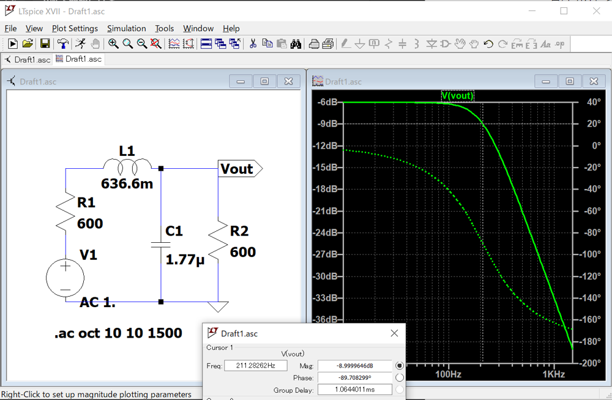
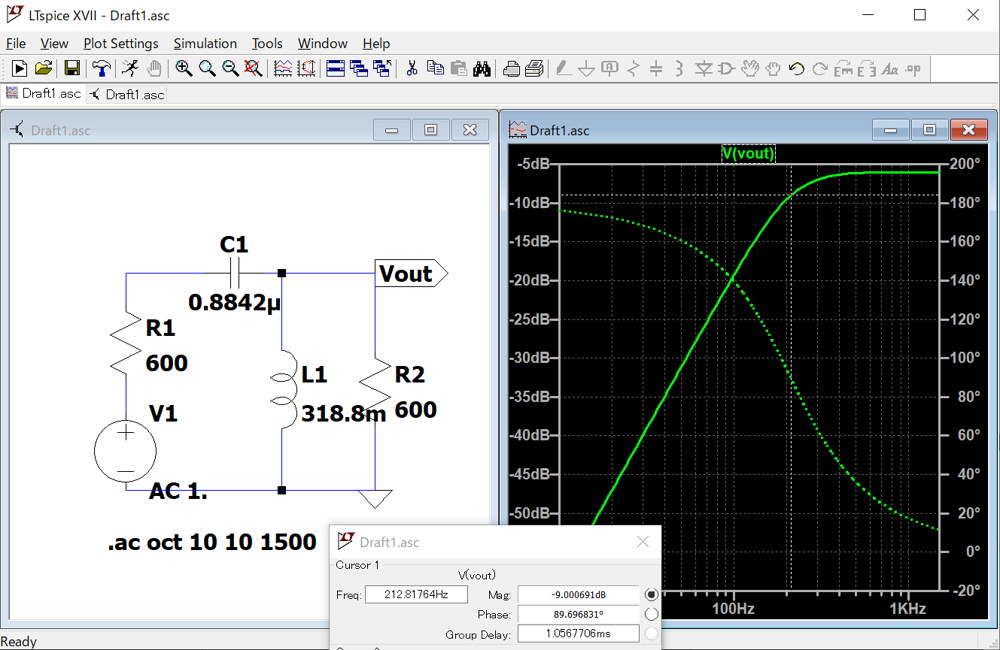

# 定K形フィルタの数値解析（レベル2）

Numerical Analysis of Constant-K Filters

## 目的 Objective

周波数フィルタリングに用いられる、定K形フィルタの周波数特性を理解する。

Understand the frequency characteristics of a constant-K filter used in frequency filtering.

## 理論 The basics

次の言葉を含むよう、各自調べてまとめること。箇条書きでなく、文章で記述すること。

Research and summarize a theory to include the following words.

- 定K形フィルタ constant‐K filter
- 周波数フィルタリング frequency filtering
- カットオフ周波数 cutoff frequency
- ローパスフィルタ low pass filter
- ハイパスフィルタ high pass filter
- ニュートン法 Newton-Raphson method

## 実験方法 Experiment method

### LTspiceによるシミュレーション Simulation with LTspice

#### ローパスフィルタ Low-pass filter

LC直列回路に内部抵抗600Ω、1VのAC電源を接続し、LPFを設計せよ。

負荷として600Ωの抵抗を接続し、負荷にかかる出力電圧の周波数特性を求めよ。

また、カットオフ周波数をグラフから求めよ。

Design the Low-pass filter by connecting an LC series circuit to AC power supply of 1V with 600Ω of internal resistance.

Connect a 600Ω resistor as a load, and obtain the frequency response of the output voltage.
Also, find the cutoff frequency from the graph.

各素子の値は以下のものを使用する。

The values for each element are as follows.

L=636.6mH

C=1.77uF

解析の例を下に示す。

An example of the analysis is shown below.

#### ハイパスフィルタ High-pass filter

LC直列回路に内部抵抗600Ω、1VのAC電源を接続し、HPFを設計せよ。

負荷として600Ωの抵抗を接続し、抵抗にかかる電圧の周波数特性を求めよ。

また、カットオフ周波数をグラフから求めよ。

Design the High-pass filter by connecting an LC series circuit to AC power supply of 1V with 600Ω of internal resistance.

Connect a 600Ω resistor as a load, and obtain the frequency response of the output voltage.
Also, find the cutoff frequency from the graph.

各素子の値は以下のものを使用する。

The values for each element are as follows.

L=318.8mH

C=0.8842uF

解析の例を下に示す。

An example of the analysis is shown below.

### プログラミングによる数値解析 Numerical analysis by programming

上で解析したローパスフィルタの出力は、以下の式で求められる。

The output voltage of the low-pass filter analyzed above can be obtained by the following equation.

$$ V_{out} = V_o \frac{1}{2-\omega^2 CL+j\omega\left(\frac{L}{R}+CR\right)} $$

同様に、ハイパスフィルタの出力は以下の式で求められる。

Similarly, the output of the high-pass filter is as follows.

$$ V_{out} = V_o \frac{\omega^2 CL}{(2\omega^2 CL-1)-j\omega\left(\frac{L}{R}+CR\right)} $$

ローパスフィルタとハイパスフィルタについて、上の式をもとに数値解析を行え。

また、それぞれのカットオフ周波数を数値計算の手法であるニュートン法で求めよ。

使用するプログラミング言語は問わない。

Analyze the low-pass and high-pass filters numerically based on the above equations.

Also, calculate each cutoff frequency using Newton-Raphson method.

Any programming language is acceptable.

参考としてPythonプログラムを提供する。

A Python program is provided for reference.

レベル3 level 3:

[github.com/ohashi-gnct/exp4e/blob/master/constantk/Constant_K_filter_level3.ipynb](https://github.com/ohashi-gnct/exp4e/blob/master/constantk/Constant_K_filter_level3.ipynb)

レベル3 level 2:

[github.com/ohashi-gnct/exp4e/blob/master/constantk/Constant_K_filter_level2.ipynb](https://github.com/ohashi-gnct/exp4e/blob/master/constantk/Constant_K_filter_level2.ipynb)

## 検討課題 Discussion

(1) ローパスフィルタとハイパスフィルタの用途について、以下の観点から調べて説明せよ。

Explain the applications of low-pass and high-pass filters from the following points.

- アナログ信号の処理・解析 Analog signal processing and analysis
- ディジタル信号の処理・解析 Digital signal processing and analysis

(2) ローパスフィルタの出力について、回路方程式から理論式を導け。

Derive the theoretical equation for the output of the low-pass filter from the circuit equation.
