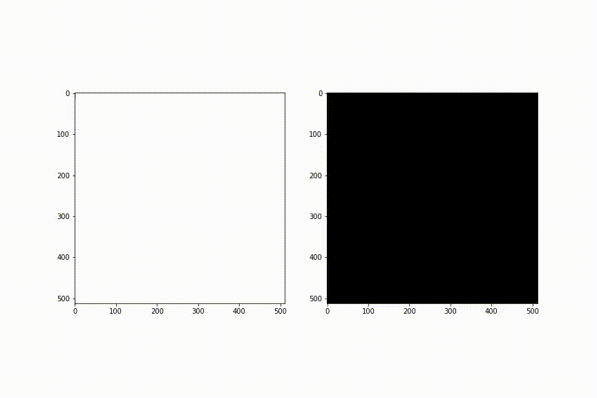

# マルチメディア信号処理

Signal prosessing for multimedia

## 目的 Objective

ディジタル信号処理について、数学的操作と具体的な結果を関連付けて理解する。

Understand digital signal processing by relating mathematical operations to specific results.

## 理論 The basics

次の言葉を含むよう、各自調べてまとめること。箇条書きでなく、文章で記述すること。

Research and summarize a theory to include the following words.

- フーリエ級数展開 Fourier series expansion
- 離散フーリエ変換 Discrete Fourier transform
- 画像の周波数 Frequency of images
- パワースペクトル Power spectrum
- スペクトログラム Spectrogram
- 畳み込み Convolution

## 実験方法 Experiment method

以下の課題を実施せよ。

Do following tasks.

使用するプログラミング言語は問わない。

Any programming language is acceptable.

参考としてPythonプログラムを提供する。

A Python program is provided for reference.

[github.com/ohashi-gnct/exp4e/blob/master/multimedia/multimedia2022.ipynb](https://github.com/ohashi-gnct/exp4e/blob/master/multimedia/multimedia2022.ipynb)

以下の課題のうち、（必須課題）は実験時間中に結果をLMSに提出せよ。

For the following tasks, submit the results to the LMS during class for the required tasks.

授業時間中に（必須課題）が終了した場合、レポートではなく（発展課題）に取り組むこと。

If required tasks are completed during class, work on the advanced tasks.

この実験では、いくつかの画像や音声を配布するが、あくまでも参考用である。

In this experiment, we will provide some images and sounds, but they are for reference only.

レポートでは自身で実験に適した画像や音声を用意すること。

In your report, use your own images and sounds suitable for the experiment.

他人が著作権を持つ画像や音声を使用する場合、

利用規約または使用の許される法的根拠を必ず確認すること。

If you use images or sounds that are copyrighted by others, 

check the terms of use or the legal basis for the permitted use.

ただし、高専機構は授業目的公衆送信補償金を支払っている。

Note that this school pays remuneration for public transmission for school lessons.

### 実験準備 Preparation

この項目は、事前に行ってくること。

Those tasks should be done in advance.

#### 画像データの周波数解析

Frequency analysis of images

画像に対して2次元高速フーリエ変換(FFT)を行い、周波数スペクトルを表示せよ。

また、IFFTによってもとの画像に戻ることを確認せよ。

#### 音声データの周波数解析

Frequency analysis of audio

何らかの音楽の波形とスペクトログラム（周波数スペクトルの時間変化）を同時に表示せよ。

Show the waveform and spectrogram of some music.

### 画像の周波数領域フィルタ Image filtering in the frequency domain

（必須課題 Required task）

画像をFFTし、低周波の領域のみ残してIFFTすると画像にローパスフィルターをかけることができる。

We can apply a low-pass filter to the image by performing an FFT to the image and an IFFT with only the low frequency range of spectrum.

画像にローパスフィルターまたはハイパスフィルターをかけ、出力された画像と元画像を比較して考察せよ。

Apply a low-pass filter or a high-pass filter to the image and compare the output image with the original image.

授業中に提出：3枚の画像をフーリエ変換した図

Assignment: Fourier transformed images of three images.

### 画像の空間領域フィルタと周波数 Frequency characteristics of image filtering in the spatial domain

（必須課題 Required task）

画像に対して移動平均フィルタとガウシアンフィルタをかけよ。

Apply a moving average filter and a Gaussian filter to the image.

それぞれの画像に対してFFTを行い、

これらのフィルタの役割について周波数の観点から考察せよ。

Perform an FFT on each filtered image 

and consider the effect of these filters in the aspect of frequency.

授業中に提出：ガウシアンフィルタをかけた画像とそのスペクトル

Assignment: Gaussian-filtered image and its spectrum

### 音声の周波数領域フィルタ Audio filtering in the frequency domain

（必須課題 Required task）

音声をFFTし、低周波の領域のみ残してIFFTすると音声にローパスフィルタをかけることができる。

We can apply a low-pass filter to the audio by performing an FFT to the audio and an IFFT with only the low frequency range of spectrum.

高周波ノイズの加えられた音声に対し、ローパスフィルターをかけて出力を得よ。

Apply a low-pass filter to the audio with high-frequency noise and get the output.

フィルターを通す前と後のスペクトログラムを比較し、考察せよ。

Compare the spectrograms of audio before and after filtering.

また、音楽に対してローパスフィルターやハイパスフィルターをかけ、聴覚上の変化について考察せよ。

Also, apply a low-pass filter or a high-pass filter to the music and consider the hearing changes.

授業中に提出：周波数フィルタをかけた音声の波形とスペクトログラム（音声ではなく画像）

Assignment: Frequency-filtered audio waveform and spectrogram

### 音声の時間領域フィルタと周波数 Frequency characteristics of audio filtering in the time domain

（発展課題 Advanced task）

音声に対して、あるサンプルから[$ n]点後までの振幅を平均するような

移動平均フィルタを設計し、適用せよ。

また、$ A\exp{-t/\tau}$（$ t $ はあるサンプルから数えたサンプル数、$ \tau$は定数）

の形で減衰する指数平滑フィルタを設計し、適用せよ。

ただし、指数平滑フィルタの長さは無限長になるが、ある程度で打ち切ること。

それぞれFFTを行い、これらのフィルタの役割について周波数の観点から考察せよ。

### サンプリングと波形の復元 Sampling and interpolation of waveform

（発展課題 Advanced task）

正弦波を荒く（1周期につき6-8点くらい）サンプリングせよ。

これらの点をパルス列とみなし、sinc関数$ \mathrm{sinc}(x) = \sin{x}/x$を畳み込み、

もとの正弦波が復元できることを確認せよ。

また、さらに荒く（1周期につき1.5点くらい）サンプリングして同様にsinc関数を畳み込むと、

正しく復元できないことを確認せよ。これがなぜかを考察せよ。